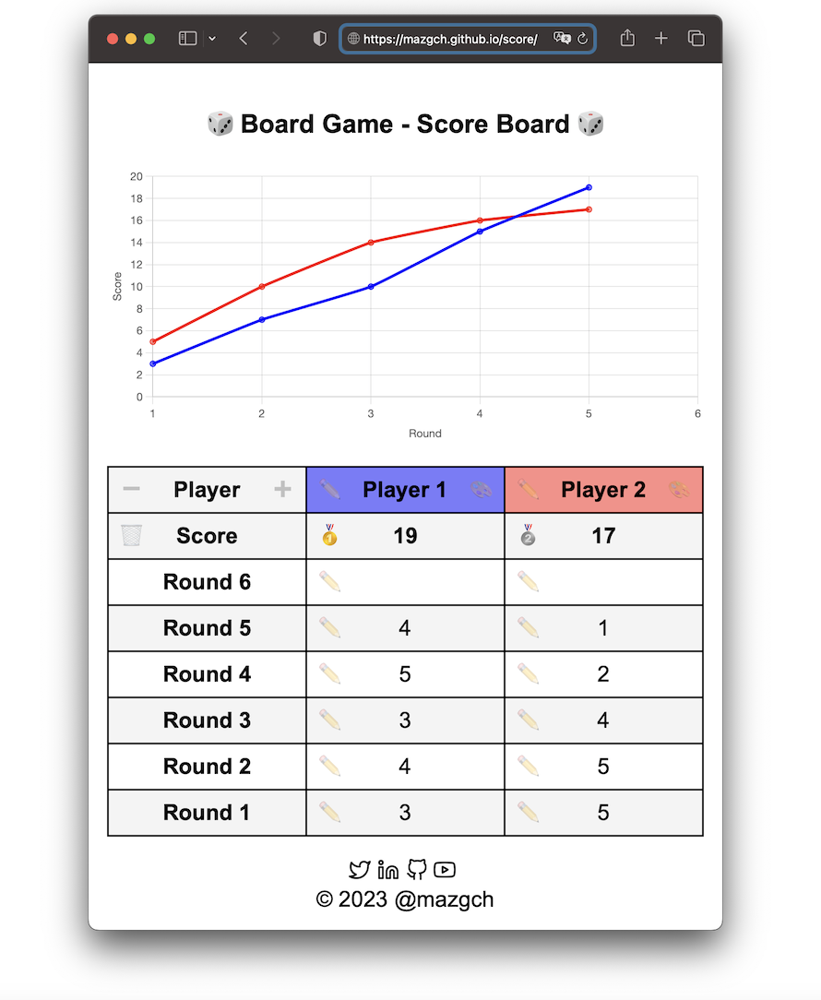

# 🎲 Board Game - Scoreboard 🎲

Ever found yourself scribbling scores on a piece of paper or spending precious game time doing math? Say goodbye to the hassle and dive straight into the fun with this innovative score tracking webpage!

## Key Features:

- **Personalize Your Game:** Set player names and their favourite color for a customized experience! Know who's in the lead with just a glance.
- **Multiplayer Support**: Whether it's just you or a group of friends, keep track of who is leading with ease - supports from single to multiple players!
- **Visualize Your Progress:** Watch your score rise (or fall!) with a per-round development line graph. Perfect to gain game insights.
- **User-Friendly Interface:** Easy to use, so you can focus on strategizing rather than tallying.
- **Real-time Updates:** Add scores on-the-fly and see the changes immediately on the color-coded graph.
- **Compatibility:** Whether you're on a tablet, phone, or desktop, this page is optimized for all devices. Score anytime, anywhere!
- **Save Your Time:** Less time counting means more time playing.

So why wait? Experience the best in board game night advancements and see who's leading the pack at a glance!

Check it out now: https://mazgch.github.io/score/

If you are tired of counting manualy the score during your favourite turn based board game: this simple webpage is your solution. 

